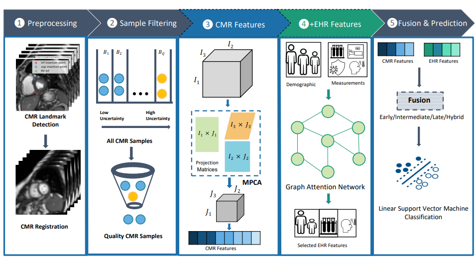
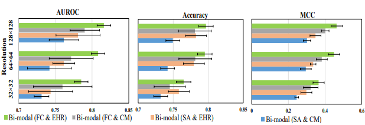
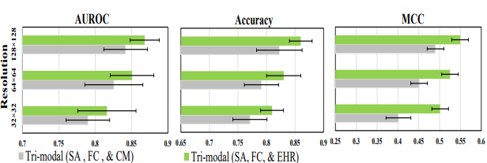
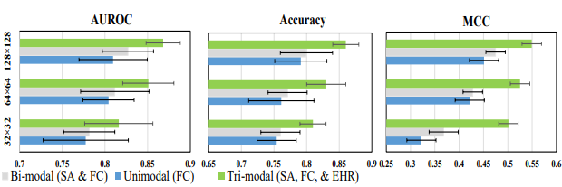

# Hemodynamics Assessment

Research Paper: Interpretable Multimodal Learning for Cardiovascular Hemodynamics Assessment

Author names: Prasun C. Tripathi, Sina Tabakhi, Mohammod N I Suvon, Lawrence Schobs, Samer Alabed, Andrew J Swift, Shuo Zhou, and Haiping Lu

Affiliation: University of Sheffield, UK

Preprint Link: 

# Proposed Pipeline

# Results

# Acknowledgement
The study was supported by the Wellcome Trust grants 215799/Z/19/Z and 205188/Z/16/Z.
